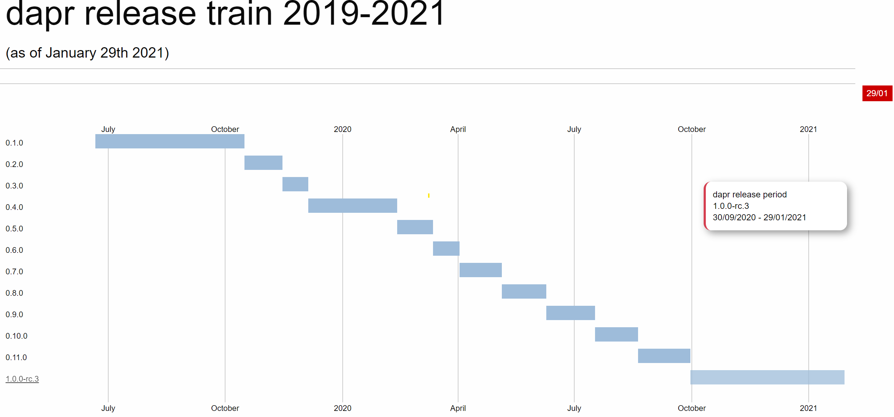
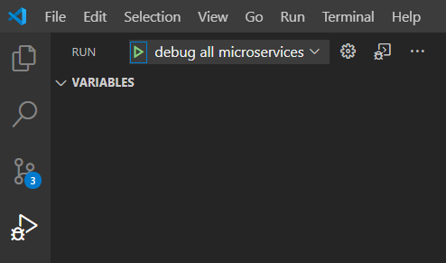
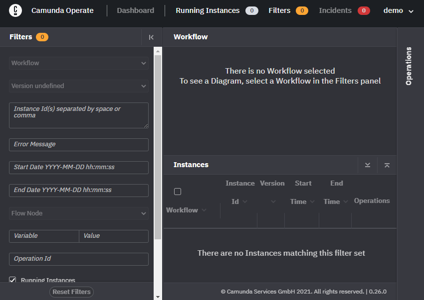
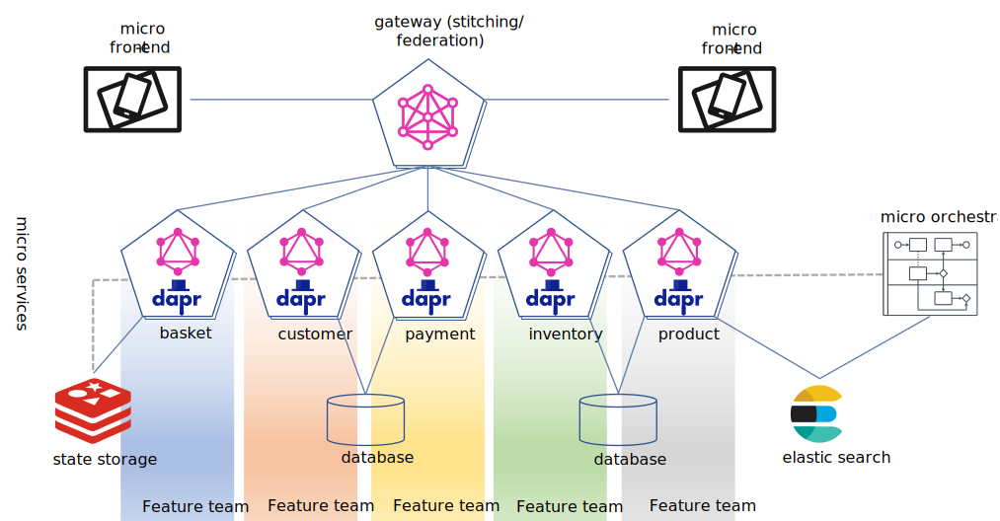
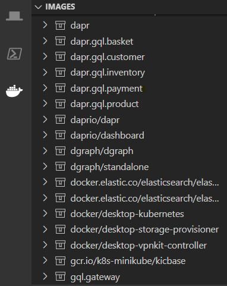
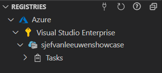
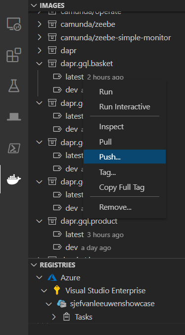
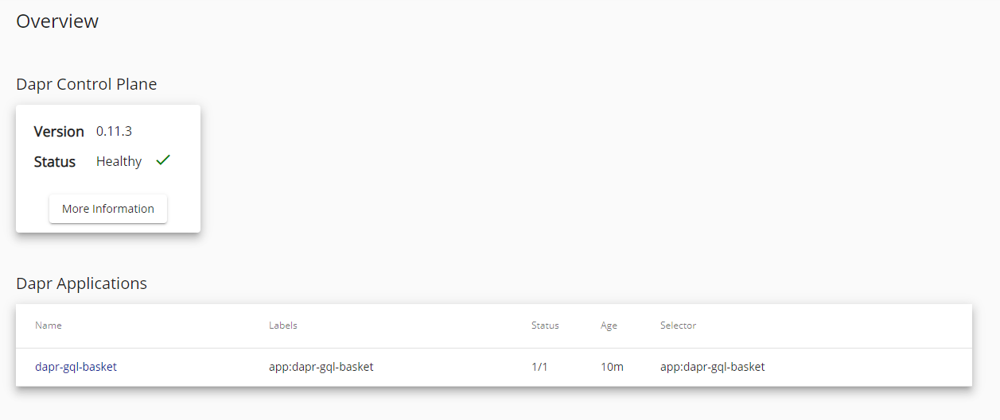

- [Showcase](#showcase)
  - [Status](#status)
  - [Stack used](#stack-used)
    - [Micro services](#micro-services)
      - [Popularity](#popularity)
      - [Runtime language services](#runtime-language-services)
      - [dapr Release Train](#dapr-release-train)
    - [Micro Service Orchestration](#micro-service-orchestration)
- [Setup](#setup)
  - [Install Dapr CLI](#install-dapr-cli)
  - [Clone repo](#clone-repo)
  - [Setting up secrets (important)](#setting-up-secrets-important)
  - [vscode debug launch](#vscode-debug-launch)
    - [Debug all micro services](#debug-all-micro-services)
    - [Service registry and ports](#service-registry-and-ports)
      - [Swagger endpoints](#swagger-endpoints)
      - [GraphQL endpoints](#graphql-endpoints)
      - [GraphQL Gateway](#graphql-gateway)
    - [Install additional tools.](#install-additional-tools)
  - [npm Scripts](#npm-scripts)
    - [gql-doc](#gql-doc)
    - [gql-schemas](#gql-schemas)
    - [gqlg](#gqlg)
    - [test / test-dashboard](#test--test-dashboard)
  - [Zeebe Micro Service Orchestration](#zeebe-micro-service-orchestration)
    - [Docker installation](#docker-installation)
- [High Level Overview](#high-level-overview)
- [Hosting Modes](#hosting-modes)
  - [Micro services](#micro-services-1)
- [Deploying to Kubernetes](#deploying-to-kubernetes)
  - [Setup dapr on Azure AKS kubernetes](#setup-dapr-on-azure-aks-kubernetes)
  - [Setup your container registry](#setup-your-container-registry)
  - [Deploying Dapr services (from vscode)](#deploying-dapr-services-from-vscode)
    - [Building your docker containers](#building-your-docker-containers)
    - [Pushing your docker Images](#pushing-your-docker-images)
    - [Managing Secrets](#managing-secrets)
    - [Attaching container Registry](#attaching-container-registry)
    - [Deploying dapr services](#deploying-dapr-services)
  - [Deploying Dapr services (GitOps)](#deploying-dapr-services-gitops)
- [GraphQL](#graphql)
  - [Client generator](#client-generator)
    - [Setup client tools](#setup-client-tools)
    - [Fetch the graphql schema](#fetch-the-graphql-schema)
    - [Generate the client](#generate-the-client)

# Showcase

A personal full stack journey. Consisting out of:

* Micro Services
* Micro (modular) Front End
* Simulation Driven Development

## Status

Very much under construction. Started with the back end and setting up docker containers and npm scripts.

## Stack used

### Micro services

In Microsoft technologies there are mainly three promising technologies. The main reason why I choose dapr over other technologies are as follows:

* Orleans only supports Actors
* More official SDK integrations for multiple languages
* Excellent documentation
* Fastest growing community
* Fast release train

#### Popularity

As per January 29th 2020


#### Runtime language services


#### dapr Release Train



### Micro Service Orchestration

For micro service orchestration we use 3 builidng blocks from camunda:latest
* [Zeebe](https://github.com/zeebe-io/zeebe) orchestration engine
* [Elastic Search](https://github.com/elastic/elasticsearch) (for storing workflow data)
* [Operate](https://docs.camunda.io/docs/product-manuals/operate/index) for monitoring and troubleshooting workflow instances
* [Monitor](https://github.com/zeebe-io/zeebe-simple-monitor) a simple monitoring application where you can test workflow manually
* [Modeler](https://github.com/zeebe-io/zeebe-modeler/releases) visual workflow for zeebe using BPMN.

# Setup

The VSCODE project consists out of Tasks/Launch json configuration. On top of this some utilities are installed as NPM packages. The scripts that are shipped in package.json with the solution are installed as dev dependencies and these node modules are executed with `npx`.

## Install Dapr CLI

The dapr runtime can be installed by following this documentation:
https://v1-rc1.docs.dapr.io/getting-started/install-dapr-cli/

To debug dapr micro services, install dapr in local mode on your dev machine.

```
dapr init --runtime-version v1.0.0-rc.4
```

## Clone repo

```
git clone https://github.com/sjefvanleeuwen/showcase.git
```

To get up and running with dapr solution. `cd to the ./showcase/src/dapr folder` from the root of the cloned repo and install the node modules.

```
cd ./showcase/src/dapr
npm install
```

## Setting up secrets (important)

dapr stores its secrets in the `./src/dapr/secrets.json` file. The secrets component configuration itself can be found in:  `./src/dapr/components/localSecretStore.yaml`. This configuration is used for `standalone mode` during your debug sessions. You will need to replace the full path to match the location of the file on your dev workstation (replace %Your Path%).

```yaml
apiVersion: dapr.io/v1alpha1
kind: Component
metadata:
  name: my-secret-store
  namespace: default
spec:
  type: secretstores.local.file
  version: v1
  metadata:
  - name: secretsFile
    value: %Your Path%/showcase/src/dapr/secrets.json
  - name: nestedSeparator
    value: ":"
```

## vscode debug launch

When starting up a new VSCode editor, in `./src/dapr/`, the project contains several launch options. The most important one you will be working with is `debug all microservices`

### Debug all micro services

This will startup the entire environment as depicted in the `high level overview`. At the time of this writing the micro orchestrator is not yet integrated in the debugging experience.

The debug options can be found in the left pane.



### Service registry and ports

The following URL's will be available as GraphQL service endpoints (and RESTful for that matter) when debugging in standalone mode.

#### Swagger endpoints

| Micro Service                      	| Native                  	| Dapr                                                          	|
|------------------------------------	|-------------------------	|---------------------------------------------------------------	|
| dapr.gql.basket                    	| localhost:10001/swagger 	| localhost:20001/v1.0/invoke/dapr-gql-basket/method    	|
| dapr.gql.customer                  	| localhost:10002/swagger 	| localhost:20002/v1.0/invoke/dapr-gql-customer/method  	|
| dapr.gql.inventory                 	| localhost:10003/swagger 	| localhost:20003/v1.0/invoke/dapr-gql-inventory/method 	|
| dapr.gql.payment                   	| localhost:10004/swagger 	| localhost:20004/v1.0/invoke/dapr-gql-payment/method   	|
| dapr.gql.product                   	| localhost:10005/swagger 	| localhost:20005/v1.0/invoke/dapr-gql-product/method   	|

#### GraphQL endpoints

| Micro Service      	| Native                  	| Dapr                                                          	|
|--------------------	|-------------------------	|---------------------------------------------------------------	|
| dapr.gql.basket    	| localhost:10001/graphql 	| localhost:20001/v1.0/invoke/dapr-gql-basket/method/graphql    	|
| dapr.gql.customer  	| localhost:10002/graphql 	| localhost:20002/v1.0/invoke/dapr-gql-customer/method/graphql  	|
| dapr.gql.inventory 	| localhost:10003/graphql 	| localhost:20003/v1.0/invoke/dapr-gql-inventory/method/graphql 	|
| dapr.gql.payment   	| localhost:10004/graphql 	| localhost:20004/v1.0/invoke/dapr-gql-payment/method/graphql   	|
| dapr.gql.product   	| localhost:10005/graphql 	| localhost:20005/v1.0/invoke/dapr-gql-product/method/graphql   	|

#### GraphQL Gateway

The GraphQL gateway federates all services. The sticthing gateway can be opened in your web browser at: http://localhost:9999/graphql when debugging.

Next to federation it also stiches schema's such as mybasket, to join several graphs from several micro services (basket, product and inventory) into one query endpoint. At the time of this writing, the gaphql gateway is still tested to the native graphql query endpoints and will soon change to be served from the dapr endpoints.

Here is the stitching example:

```graphql
# Stitching sub graphs for UX Design of the Basket View
extend type Query {
    "This is an extended query which shows a basket for the current logged in customer along with the products. This view is in accordance with the UX design and contains delegated fields from the inventory and product database"
    mybasket: [BasketItem!]! @delegate(schema: "basket", path: "basketForCustomer(id: 1)")
}

extend type BasketItem {
    "delegates the name of the product in the basket from product"
    name: String
        @delegate(
            schema: "product",
            path: "product(id: $fields:productId).name"
        )
    "delegates the description of the product in the basket from product"
    description: String
        @delegate(
            schema: "product",
            path: "product(id: $fields:productId).description"
        )
    "delegates the unit price of the product"
    unitPrice: Float
        @delegate(
            schema: "product",
            path: "product(id: $fields:productId).unitPrice"
        )
    "delegates the available stock of the product in the basket from the inventory"
    inStock: Int
        @delegate(
            schema: "inventory",
            path: "inventory(id: $fields:productId).quantity"
        )
}

```

### Install additional tools.

Here is a list of tools that will enhance your (debugging) experience with VSCODE for this project:

**dotnet core test explorer**

Unit Test Explorer for .NET Core

https://marketplace.visualstudio.com/items?itemName=formulahendry.dotnet-test-explorer

**dapr extensions**

This Dapr extension makes it easy to setup debugging of applications within the Dapr environment as well as interact with applications via the Dapr runtime.

https://marketplace.visualstudio.com/items?itemName=ms-azuretools.vscode-dapr

**C# for Visual Studio Code (powered by OmniSharp)**

Lightweight development tools for .NET Core.
Great C# editing support, including Syntax Highlighting, IntelliSense, Go to Definition, Find All References, etc. Debugging support for .NET Core

https://marketplace.visualstudio.com/items?itemName=ms-dotnettools.csharp

**Docker**

The Docker extension makes it easy to build, manage, and deploy containerized applications from Visual Studio Code. It also provides one-click debugging of Node.js, Python, and .NET Core inside a container.

https://marketplace.visualstudio.com/items?itemName=ms-azuretools.vscode-docker

**GraphQL**

GraphQL extension VSCode built with the aim to tightly integrate the GraphQL Ecosystem with VSCode for an awesome developer experience.

https://marketplace.visualstudio.com/items?itemName=GraphQL.vscode-graphql

**Live Server**
Launch a local development server with live reload feature for static & dynamic pages.

https://marketplace.visualstudio.com/items?itemName=ritwickdey.LiveServer

## npm Scripts

The following section describes the available scripts:

### gql-doc

Documents the graphql schema from the stitching/federated graphql gateway endpoint. Output example [here](https://sjefvanleeuwen.github.io/showcase/schemas/graphql/).

```
npm run gql-doc
```

### gql-schemas

Fetches the schema from the stitching/federated graphql gateway endpoint via curl and places it in the `./generated` folder.

```
npm run gql-schema
```

### gqlg

Generates a javascript serverside (nodejs) graphql client for the gateway. This command is dependend on gql-schema.
*note* this generator can not interpret the @source directive containing a repeatable ENUM. Please remove it from the fetched `schema.graphql` file in the `./generated-folder`
This command is going to be replaced by a better client/server code generator. Such as the one available at: https://graphql-code-generator.com/

```
npm run gqlg
```
### test / test-dashboard

Executes newman integration tests from the ./tests directory, which contains postman configurations. It exports the test results using a html reporter `newman-reporter-html-extra`

This command generates a new test report per run, with date/time stamp in the filename and puts it in the `./tests/` folder.

```
npm run test
```

This command overwrites a test file in the `../docs/tests/newmann folder`. Putting the live webserver on that file will result in the dashboard updated in the browser at each run. Good for dashboarding.

```
npm run test-dashboard
```

You can see an example of the dashboard [here](https://sjefvanleeuwen.github.io/showcase/tests/newman/dashboard.html)

## Zeebe Micro Service Orchestration

### Docker installation

Zeebe can be setup using docker-compose. cd to the `./src/orchestration/zeebe/operate-simple-monitor`.

```
docker-compose up
```

Camunda operate should now be available at: http://localhost:9998/

```
u/l: demo/demo
```




# High Level Overview

High level overview of what I am building.



# Hosting Modes

## Micro services

At this time the micro services run in self hosted mode. The eventual "production" mode is targeted towards kubernetes.


# Deploying to Kubernetes

Time to shift our focus on the Kubernetes hosting mode. This is also known as `Dapr First`. Dapr is a world class citizen when it comes to deployment to kubernetes. We will be deploying the dapr solution to the Azure cloud using `azure cli`.

## Setup dapr on Azure AKS kubernetes

Please follow the guide [here](./docs/kubernetes/setup-aks-cluster.md)

## Setup your container registry

Please follow the guide [here](./docs/docker/setup-azure-container-registry.md)

## Deploying Dapr services (from vscode)

The `./src/dapr` project comes with a .sln file, binding all services together. When developing larger services landscapes these can be seperated out as you scale your application. For now however we can make use of one of the Tasks that will containerize our services in order to get ready for kubernetes deployment via the Azure service registry you have already set up by now.

### Building your docker containers

In vscode, got to the task run list by pressing ctrl+ shift+p to open the command palette.

From the list pick `Task: Run Task`

Select the `build all dockers: latest`.

This will build the containers for the micro services, including the gateway

If you installed the visual studio extension for docker as indicated under `Install additional tools` in this document, you can easily check if the images are build for your docker installation.

The images list should contain the `basket, customer, inventory and payment` microserevices. Also the `gql.gateway` should be in the list.



### Pushing your docker Images

We will be pushing our images to the previously created Azure Container Registry in your resource group.
In the docker pane in vscode you see a registry menu.

1. Click on Connect Registry
2. Choose Azure
3. Open the Azure tree
4. Click on `Install Azure Ccount Extension`
5. Install the Extension
6. Sign In to Azure 

The created container registry should now appear in the view pane.



Now push all 6 images to the registry that are tagged :latest.



The Azure portal should show all images in its repositories menu for the resource group.


### Managing Secrets

Secrets will be kept seperate from our code to enforce secure software development.
For this we use the built in kubernetes built-in secret store.

You can create a secret via the kubectl cli. For now we create the same test secret that we use in standalone dapr mode for integration testing.

```
kubectl create secret generic my-secret-store --from-literal='my-secret'='If you want to keep a secret, you must also hide it from yourself. -- George Orwell, 1984'
secret/my-secret-store created
```

### Attaching container Registry

You can attach the container registry to your AKS cluster that you created and pushed the images to. remember to replace the name of the `acr` to your own unique container registry name.

```
az aks update --name showcase --resource-group showcase --attach-acr sjefvanleeuwenshowcase

```

This wil take less than a minute usually. 

### Deploying dapr services

You can find Deployment spec files in the ./src/dapr/k8s/deployment folder.
**note** that I haven't templated the file yet, you need to change the container image tag `%youracrname%` with your own registry name for now. 

`dapr-gql-basket.yaml` spec file:

```yaml
apiVersion: apps/v1
kind: Deployment
metadata:
  name: dapr-gql-basket
  namespace: default
  labels:
    app: dapr-gql-basket
spec:
  replicas: 1
  selector:
    matchLabels:
      app: dapr-gql-basket
  template:
    metadata:
      labels:
        app: dapr-gql-basket
      annotations:
        dapr.io/enabled: "true"
        dapr.io/id: "dapr-gql-basket"
        dapr.io/port: "80"
        dapr.io/config: "appconfig"
        dapr.io/log-level: "info"
    spec:
      containers:
      - name: dapr-gql-basket
        image: %youracename%.azurecr.io/dapr.gql.basket:latest
        ports:
        - containerPort: 80
        imagePullPolicy: Always

```

You can deploy using `kubectl apply`.

```
kubectl apply -f dapr-gql-basket.yaml
deployment.apps/dapr-gql-basket created
```

You can go to your previously installed dashboard to see the basket service running. If its not running issue:

```
dapr dashboard -k
```

browse to: http://localhost:8080/

You should see the basket micro service running.




## Deploying Dapr services (GitOps)

t.b.a.

# GraphQL

## Client generator

For service to service communication we can leverage graphql. The follow example shows how to create a client for the basket service, which needs to synchronously call the inventory to reserve product items. Consider the following activity diagram.

[](https://mermaid-js.github.io/mermaid-live-editor/#/edit/eyJjb2RlIjoic2VxdWVuY2VEaWFncmFtXG4gICAgcGFydGljaXBhbnQgQmFza2V0Q2xpZW50XG4gICAgcGFydGljaXBhbnQgQmFza2V0U2VydmljZVxuICAgIEJhc2tldENsaWVudC0-PkJhc2tldFNlcnZpY2U6IENoYW5nZSBxdWFudGl0eVxuICAgIHBhcnRpY2lwYW50IEludmVudG9yeVNlcnZpY2VcbiAgICBCYXNrZXRTZXJ2aWNlLS0-PkludmVudG9yeVNlcnZpY2U6IFJlc2VydmVcbiAgICBJbnZlbnRvcnlTZXJ2aWNlIC0-PiBJbnZlbnRvcnlTZXJ2aWNlOiBSZXNlcnZlUXVhbnRpdHlcbiAgICBJbnZlbnRvcnlTZXJ2aWNlIC0-PiBCYXNrZXRTZXJ2aWNlOiBSZXN1bHQgKHF1YW50aXR5KVxuICAgIEJhc2tldFNlcnZpY2UgLS0-PiBCYXNrZXRDbGllbnQ6IFJlc3VsdCAocXVhbnRpdHkpXG4iLCJtZXJtYWlkIjp7InRoZW1lIjoiZGVmYXVsdCJ9LCJ1cGRhdGVFZGl0b3IiOmZhbHNlfQ)

The basket services requests the reserve mutation service, for this it needs the mutation operation schema from the inventory service.

### Setup client tools

In order to do so, run the inventory service from VSCODE. cd to `src/dapr/dapr.gql.basket/Client`

In this directory we have setup the client as follows:

```
dotnet new tool-manifest
dotnet tool install StrawberryShake.Tools --local --version 11.0.0-preview.137
```

### Fetch the graphql schema

To generate a new client based on the operations from the iventory service, make sure the inventory service is running. Then generate a strongly typed client by executing:

```
dotnet graphql init http://localhost:10003/graphql -n Inventory
```

```
Download schema started.
Download schema completed in 978 ms
Client configuration started.
Client configuration completed in 12 ms
```

2 files will now be in the Client directory.

* berry.json
* Inventory.graphql

Furthemore a `.config` directory, containing dotnet-tools.json contains the version of the tool used.

```json
{
  "version": 1,
  "isRoot": true,
  "tools": {
    "strawberryshake.tools": {
      "version": "11.0.0-preview.137",
      "commands": [
        "dotnet-graphql"
      ]
    }
  }
}
```

### Generate the client

Create the query or mutation you want to generate code for as a new file: `ReserveMutation.graphql`

```graphql
mutation Reserve {
    reserve {
        productId
        quantity
    }
}
```

Now build the project, a `./Generated` directory will be created containing the strongly typed client code.

```
dotnet build ../
```

The `ReserveMutation` client can now be used.


