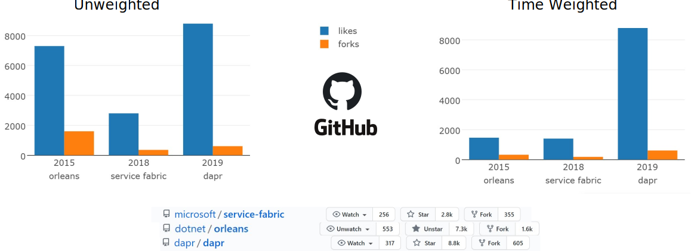

- [Showcase](#showcase)
  - [Status](#status)
  - [Stack used](#stack-used)
    - [Micro services](#micro-services)
      - [Popularity](#popularity)
      - [Runtime language services](#runtime-language-services)
      - [dapr Release Train](#dapr-release-train)
  - [Setup](#setup)
    - [Clone repo](#clone-repo)
    - [npm Scripts](#npm-scripts)
      - [gql-doc](#gql-doc)
      - [gql-schemas](#gql-schemas)
      - [gqlg](#gqlg)
      - [test / test-dashboard](#test--test-dashboard)
  - [High Level Overview](#high-level-overview)
  - [Hosting Modes](#hosting-modes)
    - [Micro services](#micro-services-1)
  - [Setup dapr on Azure AKS kubernetes](#setup-dapr-on-azure-aks-kubernetes)
  - [Setup your container registry](#setup-your-container-registry)

# Showcase

A personal full stack journey. Consisting out of:

* Micro Services
* Micro (modular) Front End
* Simulation Driven Development

## Status

Very much under construction. Started with the back end and setting up docker containers and npm scripts.

## Stack used

### Micro services

In Microsoft technologies there are mainly three promising technologies. The main reason why I choose dapr over other technologies are as follows:

* Orleans only supports Actors
* More official SDK integrations for multiple languages
* Excellent documentation
* Fastest growing community
* Fast release train

#### Popularity

As per January 29th 2020



#### Runtime language services


#### dapr Release Train


## Setup

The VSCODE project consists out of Tasks/Launch json configuration. On top of this some utilities are installed as NPM packages. The scripts that are shipped in package.json with the solution are installed as dev dependencies and these node modules are executed with `npx`.

### Clone repo

```
git clone https://github.com/sjefvanleeuwen/showcase.git
```

To get up and running with dapr solution. `cd to the ./showcase/src/dapr folder` from the root of the cloned repo and install the node modules.

```
cd ./showcase/src/dapr
npm install
```

### npm Scripts

The following section describes the available scripts:

#### gql-doc

Documents the graphql schema from the stitching/federated graphql gateway endpoint. Output example [here](https://sjefvanleeuwen.github.io/showcase/schemas/graphql/).

```
npm run gql-doc
```

#### gql-schemas

Fetches the schema from the stitching/federated graphql gateway endpoint via curl and places it in the `./generated` folder.

```
npm run gql-schema
```

#### gqlg

Generates a javascript serverside (nodejs) graphql client for the gateway. This command is dependend on gql-schema.
*note* this generator can not interpret the @source directive containing a repeatable ENUM. Please remove it from the fetched `schema.graphql` file in the `./generated-folder`
This command is going to be replaced by a better client/server code generator. Such as the one available at: https://graphql-code-generator.com/

```
npm run gqlg
```
#### test / test-dashboard

Executes newman integration tests from the ./tests directory, which contains postman configurations. It exports the test results using a html reporter `newman-reporter-html-extra`

This command generates a new test report per run, with date/time stamp in the filename and puts it in the `./tests/` folder.

```
npm run test
```

This command overwrites a test file in the `../docs/tests/newmann folder`. Putting the live webserver on that file will result in the dashboard updated in the browser at each run. Good for dashboarding.

```
npm run test-dashboard
```

You can see an example of the dashboard [here](https://sjefvanleeuwen.github.io/showcase/tests/newman/dashboard.html)

## High Level Overview

High level overview of what I am building.


## Hosting Modes

### Micro services

At this time the micro services run in self hosted mode. The eventual "production" mode is targeted towards kubernetes.


## Setup dapr on Azure AKS kubernetes

Please follow the guide [here](./docs/kubernetes/setup-aks-cluster.md)

## Setup your container registry

Please follow the guide [here](./docs/docker/setup-azure-container-registry.md)
